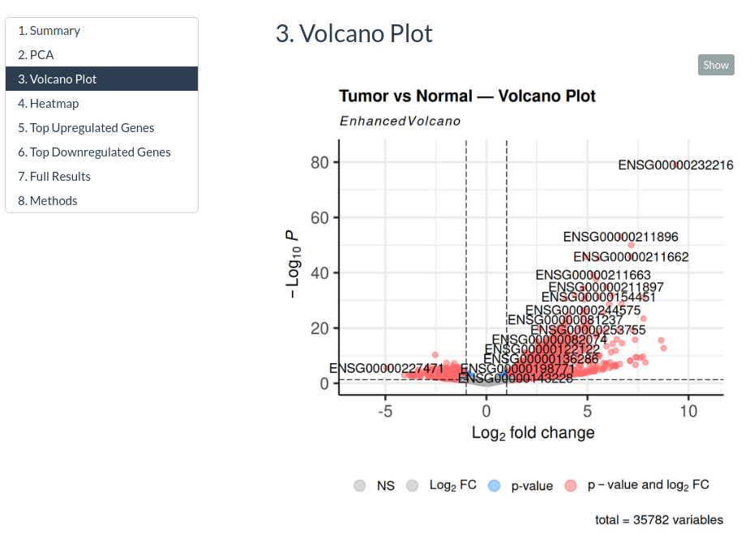
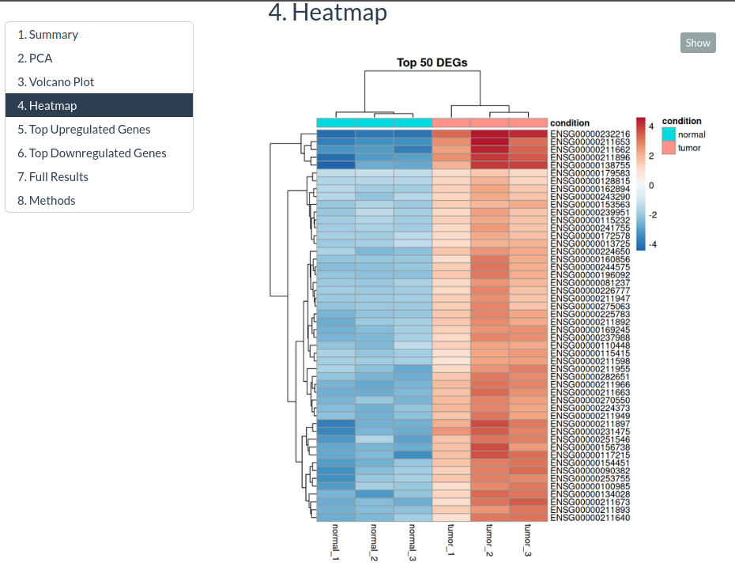
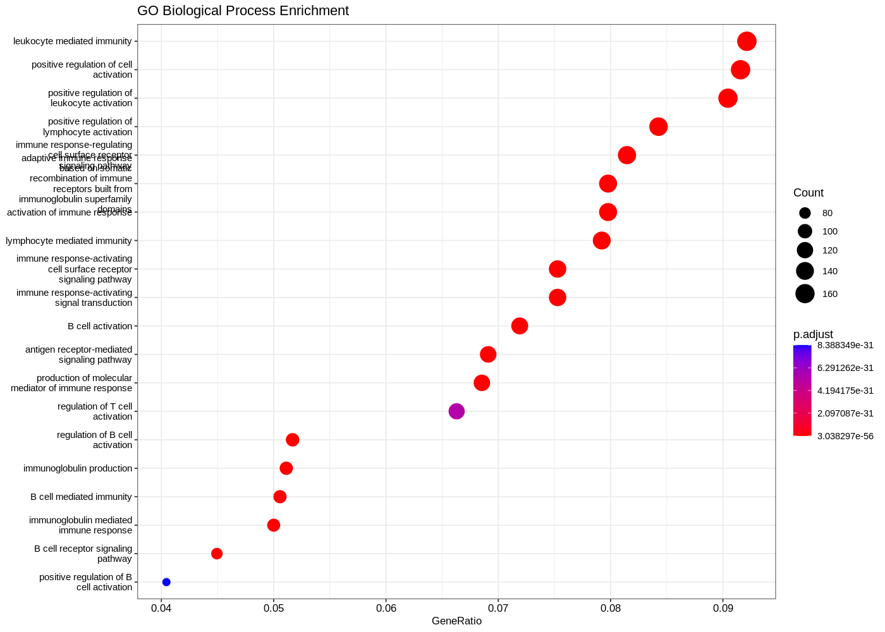
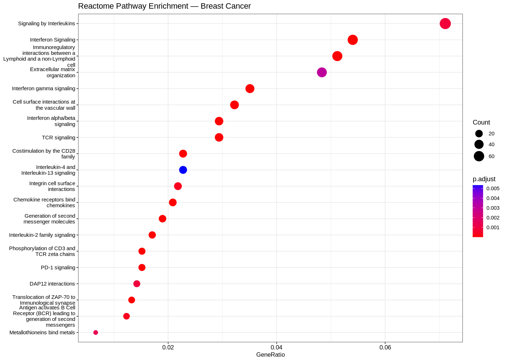

# RNA-seq Analysis Pipeline

Automated differential expression analysis pipeline for bulk RNA-seq data.
Built for research labs, pharmaceutical companies, and clinical genomics teams.

## Pipeline

FASTQ → FastQC → fastp → HISAT2 → featureCounts → DESeq2 → HTML Report

## What You Get

| Output | Description |
|--------|-------------|
| MultiQC Report | Aggregated QC across all samples |
| Count Matrix | Gene-level expression across all samples |
| DEG Table | Significant genes with log2FC and adjusted p-values |
| Volcano Plot | Visual summary of differential expression |
| HTML Report | Client-ready interactive report |

## Tools

HISAT2 · featureCounts · DESeq2 · FastQC · fastp · Snakemake · R

## Usage

    conda activate bioinfo
    snakemake --snakefile workflow/Snakefile --cores 4

## Services

Available for hire — RNA-seq analysis, single-cell RNA-seq, and multi-omics integration.

---
Lingunja | BSc Bioinformatics · Copperbelt University, Zambia

## Results

### Volcano Plot — Tumor vs Normal (PRJNA432903)

> 2,298 significant DEGs (padj < 0.05). Top hit at −log₁₀P ≈ 80. PC1 explains 86% variance.

### Heatmap — Top 50 DEGs

> Perfect hierarchical clustering: tumor vs normal completely separated.

## Pathway Analysis

### GO Biological Process Enrichment

> 711 significantly enriched biological processes.
> Top processes: leukocyte mediated immunity,
> lymphocyte activation, immune response regulation.

### Reactome Pathway Enrichment

> 39 clinically relevant pathways enriched.
> Key findings: PD-1 signaling, Interferon signaling,
> Interleukin signaling — directly relevant to
> breast cancer immunotherapy targets.
